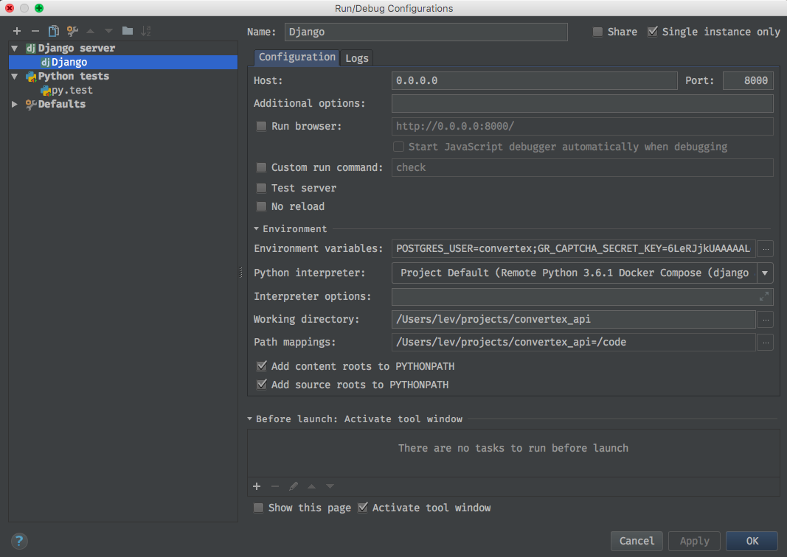

# PyCharm и Docker

Прежде всего нужно настроить конфигурацию Docker (для Unix систем указать TCP сокет и данные для подключения к нему):

Далее необходимо выбрать интерпретатор нажав на шестеренку рядом с верхней строкой "Project Interpreter" и выбрав "Remote Interpreter":

В всплывающем окне выбрать сервер, путь к docker-compose файлу, выбать Service (которые соответствует Django серверу), указать переменные среды:

В настроках Django framework включить поддержку и указать нужные пути к файлам и переменные среды:

Не забыть в настройках указать предпочтительный test runner, путь к зависимостям и формат docstring.

Для интеграции с CRM Taiga нажать на плюс и выбрать taiga. Далее ввести данные для входа и выбрать проект:

На второй вкладке вписать шаблон сообщения коммита для автозакрытия задач при пуше:

Закрыть окно настроек. В выпадающем меню PyCharm выбрать Run -> Edit Configurations. Во всплывающем окне нажать на плюс и добавить во-первых Django со следующими настройками:

Во всплывающем окне нажать на плюс и добавить во-вторых py.test (или Django test, если используете стандартный runner) со следующими настройками:

Теперь можно в верхем выпадающем меню выбрать py.test и нажать кнопку зеленую Run (если выбрать Django, то запуститься dev сервер):

